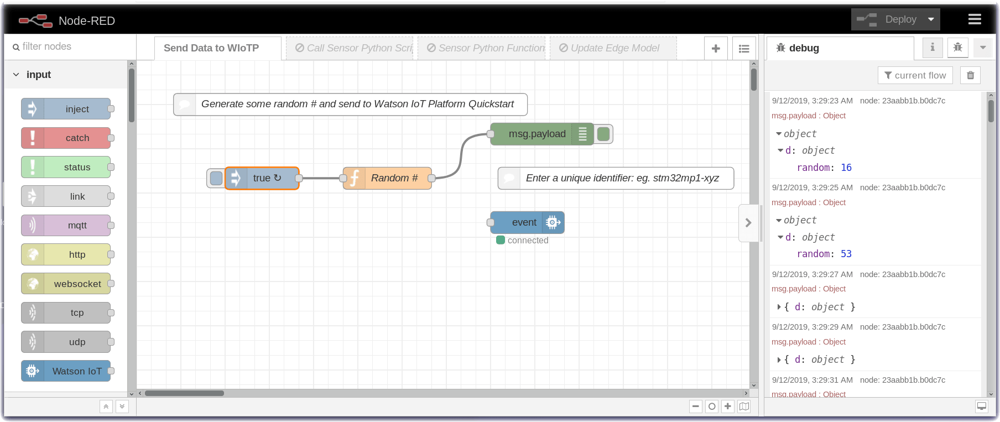

*Quick links :*
[Home](/README.md) - [Unbox your STM32MP1 Discovery Kit](UNBOX.md) - [PowerUp](POWERUP.md) - [Sensor Data](SENSORDATA.md) - [**Connect to Node-RED**](EDGE-NODERED.md) - [Send Data to QuickStart](EDGE-QUICKSTART.md)
***
# Learn about Node-RED

**Node-RED** is a open source project and flow-based programming environment from the
[OpenJS Foundation](https://openjsf.org/projects/#growth). It provides a palette of nodes that allow users
to very quickly wire up IoT applications that can combine streams of both physical and digital events.
The [Node.JS](https://nodejs.org/) runtime is easy to install on both devices (laptops, edge) and the cloud, and provides a framework for extending its capabilities.

[Node-RED](https://nodered.org) applications, or flows, are created using a browser based editor served from the Node-RED runtime.  There is a palette of nodes installed out of the box, but there are a wealth of additional [nodes](https://flows.nodered.org/?type=node&num_pages=1) available to be installed to add additional capabilities to Node-RED.

Node-RED flows are created by dragging nodes from the pallet then connecting them in the editor.



# Connect to Node-RED running on the STM32MP1

Open a browser on your laptop and create a new tab.  Visit the Node-RED web server running on your STM32MP1 edge device and port :1880
```
http:\\10.37.254.nnn:1880
```

The Node-RED runtime and editor are running on the STM32MP1 Linux image.

In this first flow (above), the blue **Inject** node is triggering an event every 2 seconds.  The tan **Function** node implements a small snippet of javascript that generates a random number [1-100] and stores that into a JSON object.  Lastly. a green **debug** node prints the random number. By Node-RED convention, messages are passed from one node to the next in a msg.payload JSON object.


To get started with the cloud, let's send this random number to Watson IoT Platform Quickstart. Follow the [next section](EDGE-QUICKSTART.md) to complete the setup.

---

*Quick links :*
[Home](/README.md) - [Unbox your STM32MP1 Discovery Kit](UNBOX.md) - [PowerUp](POWERUP.md) - [Sensor Data](SENSORDATA.md) - [**Connect to Node-RED**](EDGE-NODERED.md) - [Send Data to QuickStart](EDGE-QUICKSTART.md)
***
