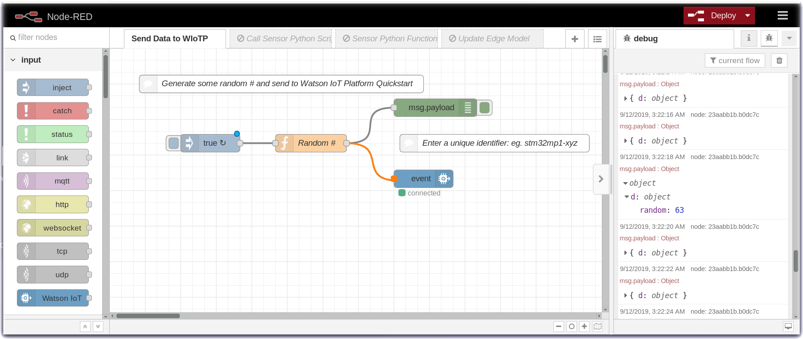
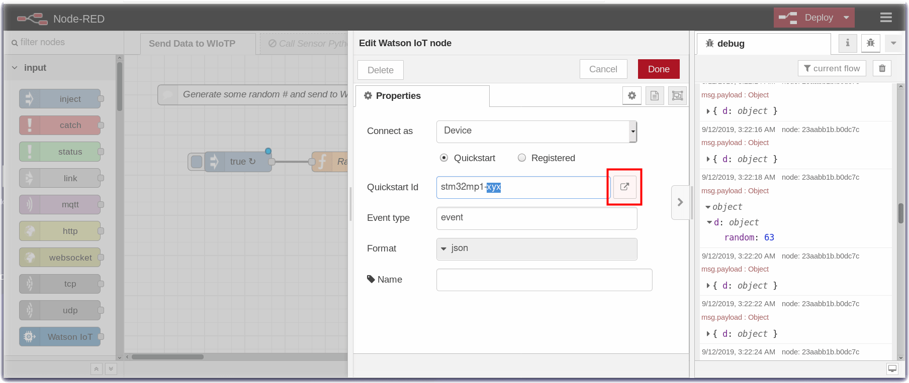
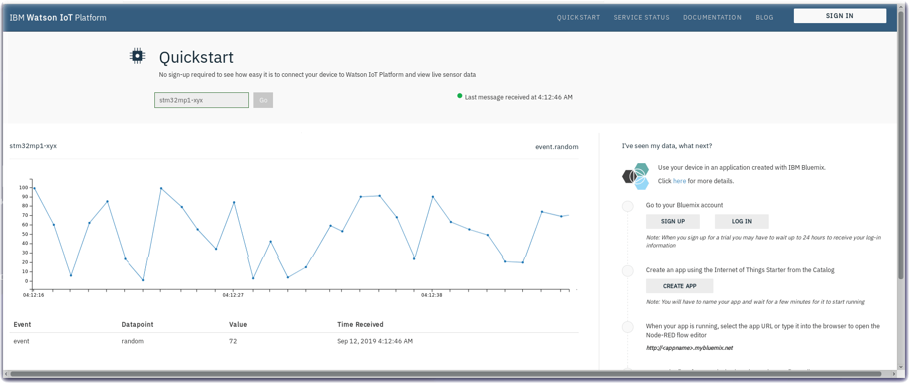

*Quick links :*
[Home](/README.md) - [Unbox your STM32MP1 Discovery Kit](UNBOX.md) - [PowerUp](POWERUP.md) - [Sensor Data](SENSORDATA.md) - [Connect to Node-RED](EDGE-NODERED.md) - [**Send Data to QuickStart**](EDGE-QUICKSTART.md)
***
## Watson IoT Quickstart

Quickstart is a way of getting a single device sending data to Watson IoT Platform that you can visualize in your browser.

See how easy it is to connect your device to Watson IoT Platform and view live sensor data.

Quickstart allows you to experiment without having to register.

## Wire the Watson IoT Quickstart Node into your flow

The following steps demonstrate how to extend the Random number print out and send that data to Watson IoT Quickstart.

- Drag a wire from the Function node output nodelet to the dark blue Watson IoT Quickstart node.
  
- Double click on the dark blue Watson IoT Quickstart node.
- Change the Quickstart Id to something unique like **stm32mp1-your-initials**
- Click on the **Launch** icon which will open a new web browser tab to the [Quickstart service](https://quickstart.internetofthings.ibmcloud.com) running in Watson IoT platform.
- No data is arriving yet in the Cloud but leave the tab open and return to the Node-RED tab.
- Press the red Done button
- Press the red Deploy button

- Now, return to the Quickstart tab.

Our Random number generator is sending data to Watson IoT Platform. 

*Quick links :*
[Home](/README.md) - [Unbox your STM32MP1 Discovery Kit](UNBOX.md) - [PowerUp](POWERUP.md) - [Sensor Data](SENSORDATA.md) - [Connect to Node-RED](EDGE-NODERED.md) - [**Send Data to QuickStart**](EDGE-QUICKSTART.md)
***
