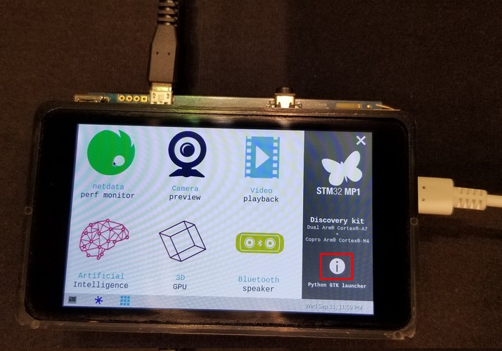
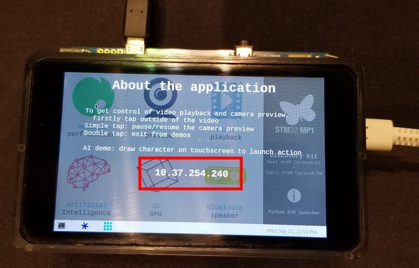
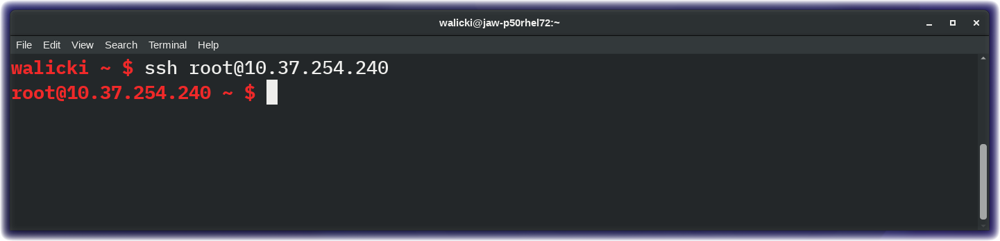

*Quick links :*
[Home](/README.md) - [Unbox your STM32MP1 Discovery Kit](UNBOX.md) - [**PowerUp**](POWERUP.md) - [Sensor Data](SENSORDATA.md) - [Connect to Node-RED](EDGE-NODERED.md) - [Send Data to QuickStart](EDGE-QUICKSTART.md)
***

# Laptop Software Prerequisites

- Remote access Terminal client
  - Linux / Mac users already have **ssh** available
  - Windows users will need a ssh terminal client (eg PuTTY)


- Serial Terminal program
  - Linux / Mac users already have **screen**
  - Windows users will need a serial terminal client (eg PuTTY)


- Web Browser

# OpenSTLinux Open Embedded

As a mainlined open-source Linux distribution, [OpenSTLinux Distribution](https://www.st.com/en/embedded-software/stm32-mpu-openstlinux-distribution.html) is a key element of the STM32 Embedded Software solution for STM32 multi-core microprocessors (MPU) embedding a single or dual Arm® Cortex®-A7 core.

Developers can customize the OpenEmbedded Yocto distribution based on their specific needs by following the [Developer Guide](https://wiki.st.com/stm32mpu/wiki/Getting_started/STM32MP1_boards/STM32MP157C-DK2/Develop_on_Arm%C2%AE_Cortex%C2%AE-A7)  That is outside the scope of this workshop.

To enable the X-NUCLEO-IKS01A2 motion MEMS and environmental sensors, the [kernel has been recompiled for this workshop](https://wiki.st.com/stm32mpu/wiki/Getting_started/STM32MP1_boards/STM32MP157C-DK2/Develop_on_Arm%C2%AE_Cortex%C2%AE-A7/Modify,_rebuild_and_reload_the_Linux%C2%AE_kernel) to include these iks01a2 modules.

For the workshop. the OpenSTLinux distribution image has also been extended with the [meta-iot-cloud](https://github.com/intel-iot-devkit/meta-iot-cloud) layer which includes Node.js, Node-RED and Watson IoT Connectivity.

If you have not yet done so, insert the SD card and plug in the USB-A to USB-C cable to power up the STM32MP157C Discovery Kit.

## Identify the STM32MP1 Discovery Kit WiFi IP Address

Once the Discovery Kit powers up, a sample demo application will start.  With your finger, use the touchscreen to click on the About (info) icon in the lower right corner.



For this workshop, the OpenSTLinux image has been pre-configured to connect automatically to the ST Microelectronics Developer Conference WiFi network.
```
ssid="STDEVCON19_CLD_WORKSHOP"
psk="Connect_STM32"
```
The WiFi IP Address of the board will be displayed.  Note the IP Address.



### Connect your laptop to this WiFi network

Depending on your laptop, connect to the WiFi network.
```
ssid="STDEVCON19_CLD_WORKSHOP"
psk="Connect_STM32"
```

## **ssh** to your STM32MP1 Discovery Kits

- Open a terminal console window on your laptop and run the **ssh** command or Windows terminal program.
```sh
ssh root@10.37.254.nnn
```



The security conscious developers in the audience will want to change the root password (using the **passwd** command) to keep your workshop participant colleagues from hijacking your board.  Remember your password if you reset it.

Proceed to the next section to query the [sensor data](SENSORDATA.md)

*Quick links :*
[Home](/README.md) - [Unbox your STM32MP1 Discovery Kit](UNBOX.md) - [**PowerUp**](POWERUP.md) - [Sensor Data](SENSORDATA.md) - [Connect to Node-RED](EDGE-NODERED.md) - [Send Data to QuickStart](EDGE-QUICKSTART.md)
***
