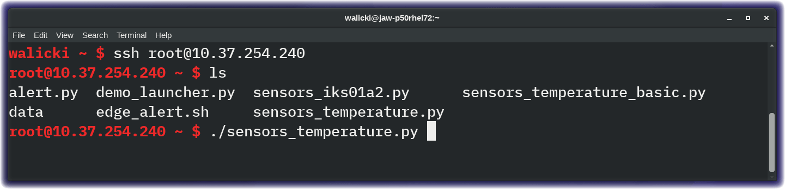
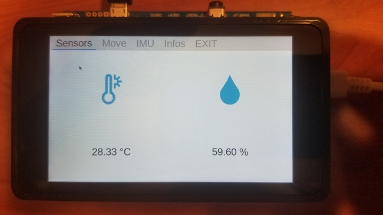
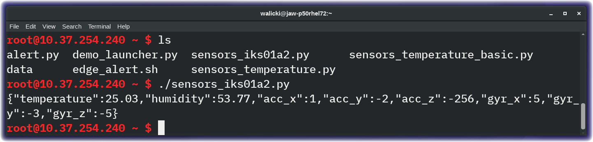

*Quick links :*
[Home](/README.md) - [Unbox your STM32MP1 Discovery Kit](UNBOX.md) - [PowerUp](POWERUP.md) - [**Sensor Data**](SENSORDATA.md) - [Connect to Node-RED](EDGE-NODERED.md) - [Send Data to QuickStart](EDGE-QUICKSTART.md)
***

## Verify the IKS01A2 sensor board is connected

In the previous section, we connected via a terminal window to the STM32MP1 Discovery Kit.

Before we can send sensor data to the IBM Cloud, let's confirm that the X-NUCLEO-IKS01A2 motion MEMS and environmental sensor expansion board is properly connected.

From the ssh terminal, in the /home/root directory, run the **sensors-temperature.py** command
```sh
$ ./sensors_temperature.py
```



Explore the Sensor application and then exit the app.



### JSON Formatted Sensor Readings

Let's next simplify the fancy sensor GUI down to a sensor readings JSON string that would be easier to send to the IBM Watson IoT Platform. This JSON formatted data will be transmitted over **MQTT** in the next section.

Run the **sensors-iks01a2.py** command
```sh
$ ./sensors_iks01a2.py
```



Proceed to the next section to learn about [Node-RED](EDGE-NODERED.md)

*Quick links :*
[Home](/README.md) - [Unbox your STM32MP1 Discovery Kit](UNBOX.md) - [PowerUp](POWERUP.md) - [**Sensor Data**](SENSORDATA.md) - [Connect to Node-RED](EDGE-NODERED.md) - [Send Data to QuickStart](EDGE-QUICKSTART.md)
***
