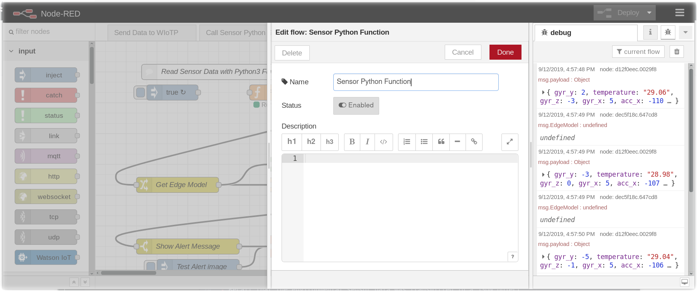
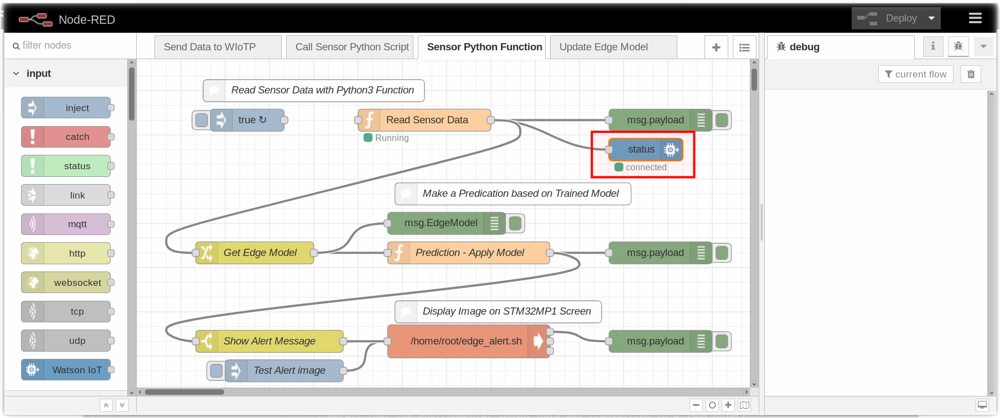
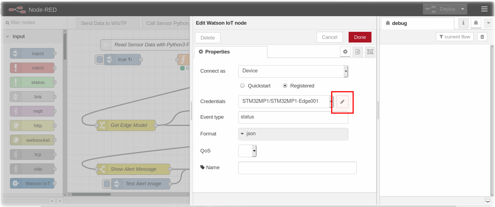
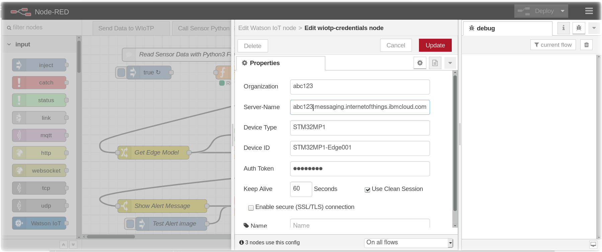
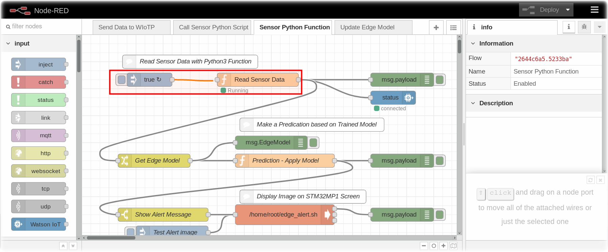
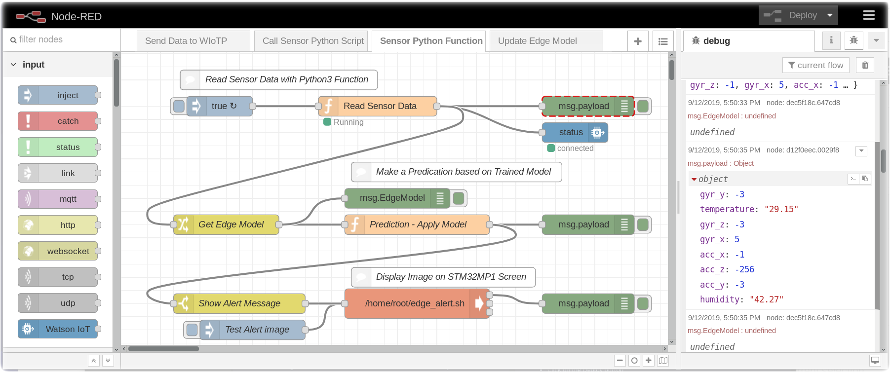

*Quick links :*
[Home](/README.md) - [IoT Platform Starter](CREATEIOTP.md) - [Device Types and Devices](DISCOVERYDEVICE.md) - [Node-RED Setup](NODERED.md) - [Sensor Data](DISCOVERYIOTDATA.md) - [Node-RED Charts](DASHBOARD.md) - [Store Data in Cloud Storage](CLOUDANT.md) - [Historical Charts](HISTORY.md) - [Watson Studio](STUDIO.md) - [Jupyter Notebooks](JUPYTER.md)
***

# Send Device Environmental Sensor Data in Node-RED

## Lab Objectives

In this lab you will build a flow that sends Device environmental temperature and humidity sensor data.  You will learn:

- How to enable a Node-RED flow and configure IoT Nodes
- How to output the Device environmental temperature and humidity data.

### Introduction

In just a few nodes, Node-RED can send the STM32MP1 environmental sensor data from the edge over MQTT to Watson IoT Platform.  

### Step 1 - Enable the Sensor Python Function

- Click on the **Sensor Python Function** tab and click on the **Enable** button
- Click on the Done button



### Step 2 - Configure the Watson IoT Credential

- Click on the **Watson IoT Out Node** named **status**



- Click on the **Pencil** icon



- In the **Organization** and **Server-name** entry fields replace the *abc123* with your Watson IoT Org 6 character name.
- Enter your *MySecretAuthToken* (or whatever token you assigned) in the **Auth Token** field
- Click on the **Update** button



- Click on the **Done** button

### Step 4 - Wire the Node-RED nodes together

- Wire the **Inject** node to the **Function** Node.



- Click on the **Deploy** button

## Step 4 - Node-RED Debug Nodes

- Recall that the environmental sensor data was transmitted in a JSON object.  You will see it in the Debug panel being sent to Watson IoT Platform

 ```
 { "d": {"temperature":T,"humidity":H,"acc_x":X,"acc_y":Y,"acc_z":Z,"gyr_x":X,"gyr_y":Y,"gyr_z":Z} }
 ```


**Congratulations** - Your Node-RED flow is sending sensor data from the STM32MP1 board.

Continue to the next step - [Node-RED Charts](DASHBOARD.md)
***
*Quick links :*
[Home](/README.md) - [IoT Platform Starter](CREATEIOTP.md) - [Device Types and Devices](DISCOVERYDEVICE.md) - [Node-RED Setup](NODERED.md) - [Sensor Data](DISCOVERYIOTDATA.md) - [Node-RED Charts](DASHBOARD.md) - [Store Data in Cloud Storage](CLOUDANT.md) - [Historical Charts](HISTORY.md) - [Watson Studio](STUDIO.md) - [Jupyter Notebooks](JUPYTER.md)
***
