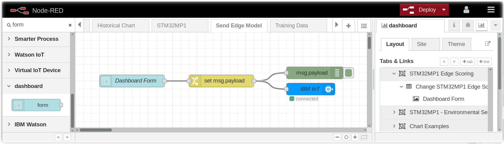
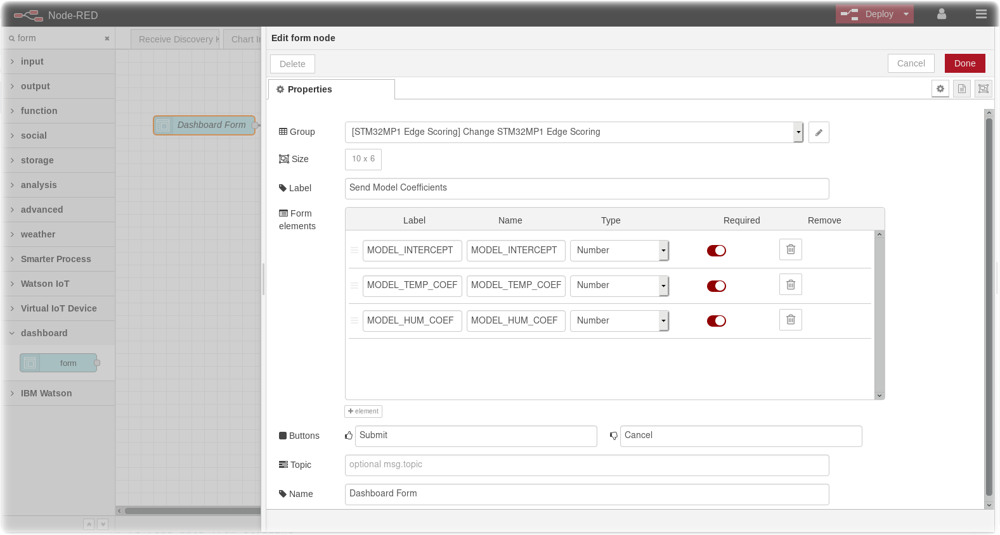
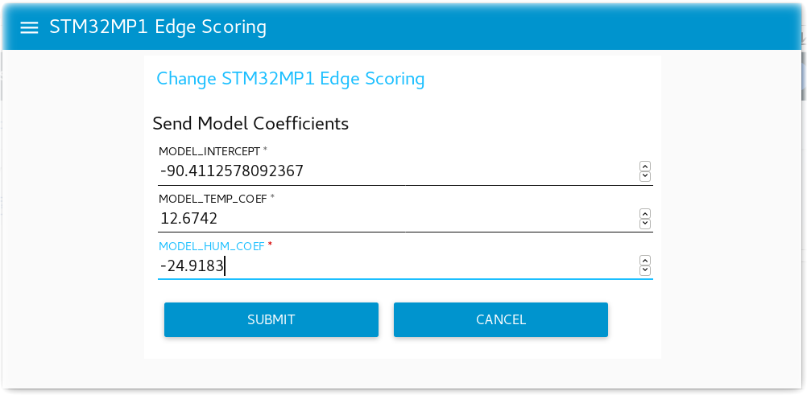
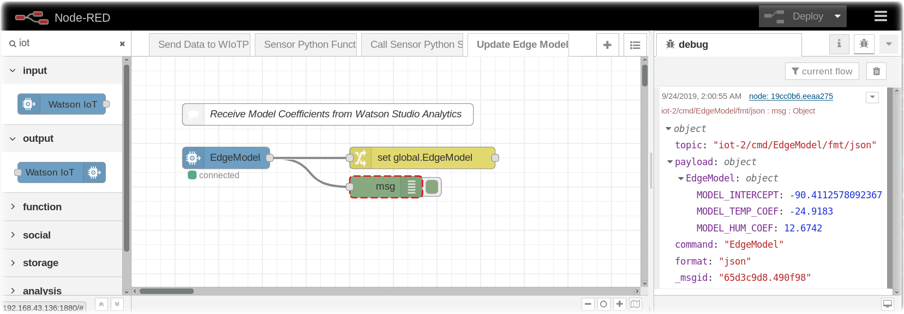
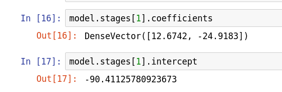
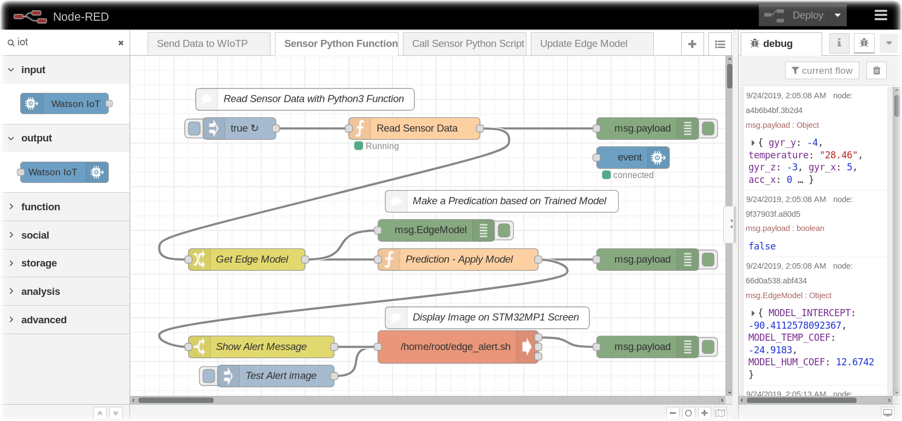

*Quick links :*
**Part 3** - [Home](/README.md) - [Watson Studio](STUDIO.md) - [Training Data](TRAINING.md) - [Notebooks](JUPYTER.md) - [**STM32MP1 model**](MODEL.md) - [Summary](SUMMARY.md)
***

# Run the model on the STM32MP1 device

## Learning Objectives

In this section you will learn how to take the model parameters generated in the previous section and implement a function to run the model on the STM32MP1 to provide real-time classification.

## Deploy the Model to the Edge device

Now that the Jupyter notebook and Spark have determined the classification model parameters, the parameters need to be sent to the STM32MP1 Edge Device for real-time scoring.

## Node-RED Form to Deploy the coefficient Model parameters

In the Node-RED instance running on IBM Cloud, import or create this [flow](flows/NR-deploy-model-form.json) using the Dashboard form node.





## Receive Model Parameters on the Edge

When the form in the IBM Cloud deploys the model, the model coefficient values will be sent in an MQTT packet to the STM32MP1 Edge device.  This [flow](flows/NR-edge-receive-model-coef.json) will receive the model coefficients and store them in a global.



## Logistic regression

The algorithm at the heart of the model we generated is [Logistic Regression](https://en.wikipedia.org/wiki/Logistic_regression), which uses the Logit function (long-odds) then applies the Logistic sigmoid function:

Logit function for 2 predictor values h and t (humidity and temp) is: ```C + w1*h + w2*t``` where C is a constant and w1 and w2 are weighting values for the predictors.

The values of C, w1 and w2 are the values from the Jupyter Notebook in the previous section: 

Here the coefficients are w1 and w2 and the intercept is the constant C.  Note the order of the weightings was specified by the order of the properties fed into the Vector Assembler:

```python
vectorAssembler = VectorAssembler(inputCols=["humidity","temp"], outputCol="features")
```

so the first coefficient is the weighting for the humidity property and the second coefficient is the weighting for the temperature property.

The sigmoid function is: ```f(x) = 1/(1+e^-x)```

Given the two functions we can create an implementation in Node-RED that can be run on the Node-RED edge application for edge classification and scoring:

## Edge Prediction
 The edge device will apply the model coefficients and score the real-time temperature and humidity readings to determine if your finger is on the HTS221 sensor.


***
**Part 3** - [Watson Studio](STUDIO.md) - [Training Data](TRAINING.md) - [Notebooks](JUPYTER.md) - [**STM32MP1 model**](MODEL.md) - [Summary](SUMMARY.md)
***
